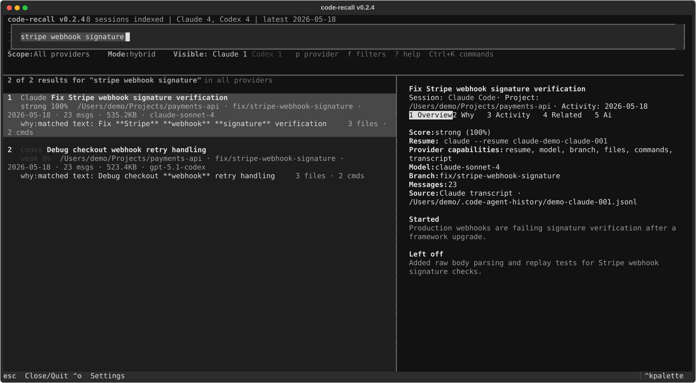
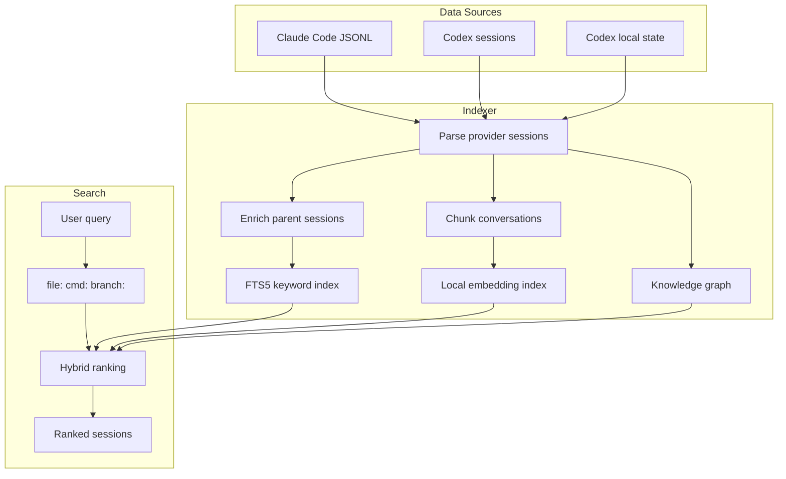

<div align="center">

# code-recall

**Find the coding-agent session you vaguely remember.**

Search, inspect, chat with, and resume your local Claude Code and Codex history from one fast terminal UI.

[](LICENSE)
[](https://python.org)
[](#development)
[](#privacy)
[](#providers)

</div>

<p align="center">
  
</p>

```bash
pip install 'code-recall[all]'
code-recall "stripe webhook signature"
```

## Why

Coding agents leave behind useful local transcripts, but built-in resume pickers are optimized for recent sessions. After a few weeks, you remember the shape of the work, not the exact title:

- "the session where we fixed Stripe webhook signatures"
- "the dashboard query that got slow after adding invoices"
- "the Docker healthcheck that broke deploys"
- "the branch where the OAuth callback tests were added"

**code-recall turns those transcripts into a searchable memory layer.** It indexes Claude Code and Codex sessions, ranks results with keyword search, semantic search, reranking, and graph signals, then lets you jump back into the right project with the right provider command.

## What It Does

- Search Claude Code and Codex sessions together.
- See exactly **why** a session matched your query.
- Filter and search by provider, project, branch, file, or command.
- Resume in the original project directory with `claude --resume ...` or `codex resume ...`.
- Chat with a selected transcript from the TUI.
- Keep the index fresh with quick incremental indexing and Claude Code session-end hooks.
- Stay local-first: your SQLite index and transcript reads stay on your machine.

## Install

<details open>
<summary><strong>pip</strong></summary>

```bash
# Everything: TUI, semantic search, reranking, sqlite-vec
pip install 'code-recall[all]'

# Smaller installs
pip install code-recall                  # keyword search only
pip install 'code-recall[semantic]'      # + embeddings and reranking
pip install 'code-recall[tui]'           # + interactive terminal UI
```
</details>

<details>
<summary><strong>uv</strong></summary>

```bash
uv tool install code-recall --with textual --with fastembed --with sqlite-vec
```
</details>

<details>
<summary><strong>From source</strong></summary>

```bash
git clone https://github.com/lupuletic/code-recall
cd code-recall
uv venv && source .venv/bin/activate
uv pip install -e ".[all]"
```
</details>

## Usage

```bash
# Interactive TUI - starts with recent sessions; type to search
code-recall

# Direct search
code-recall "stripe webhook signature"
code-recall "slow account dashboard query"
code-recall "docker healthcheck deploy"

# Search graph metadata directly
code-recall "file:src/webhooks/stripe.ts"
code-recall "cmd:pnpm test"
code-recall "branch:fix/stripe-webhook-signature"

# Combine graph prefixes with regular text
code-recall "file:schema.prisma migration"
code-recall "branch:main release workflow"

# AI investigation over indexed evidence + read-only transcript access
code-recall ask "where did we fix webhook signature verification?"
code-recall investigate "summarize sessions related to checkout retries"

# Index controls
code-recall index                  # indexes Claude Code + Codex by default
code-recall index --no-codex       # Claude Code only for this run

# Output formats
code-recall "query" --no-tui       # plain text
code-recall "query" --json         # JSON for scripting

# Updates
code-recall update
code-recall update --yes
```

## TUI Controls

| Key | Action |
|-----|--------|
| Type or `/` | Focus search and search as you type |
| `Tab` / `Shift+Tab` | Move between search, results, and detail panes |
| `Down` / `Up` | Navigate results |
| `Enter` / `Right` | Focus the detail pane for the selected result |
| `1`-`5` | Switch detail tabs: Overview, Why, Activity, Related, AI |
| `p` | Cycle provider scope: all, Claude Code, Codex |
| `r` | Resume selected session |
| `c` | Copy selected resume command |
| `o` | Open the selected project folder |
| `Ctrl+A` | Ask AI to investigate the current query/results |
| `Ctrl+K` | Open the command palette |
| `Ctrl+O` / `f` | Open settings |
| `?` | Show help |
| `Esc` | Close detail/help or quit |

With an empty search box, the TUI shows your most recent indexed sessions. Results include provider badges, project/branch context, activity, score quality, file/command counts, and a short `why:` line. The detail pane has Overview, Why, Activity, Related, and AI tabs. On narrow terminals, the detail pane opens as a focused view.

## Search

The default search mode is `hybrid`.

```bash
code-recall config search_mode hybrid   # keyword + semantic + reranking
code-recall config search_mode keyword  # FTS only, fastest, no semantic deps
code-recall config search_mode llm      # + assistant reranking, slower
code-recall config limit 20
```

The ranking pipeline combines:

| Stage | What it does |
|-------|--------------|
| FTS5 keyword search | Fast BM25 search across summaries, prompts, messages, and project paths. |
| Structured prefixes | Exact graph lookups for `file:`, `cmd:`, and `branch:` queries. |
| Semantic search | Local embeddings over conversation chunks when semantic extras are installed. |
| Knowledge graph | Connects sessions through shared files, commands, branches, and project context. |
| Cross-encoder rerank | Improves top-result precision for hybrid mode. |
| Optional LLM rerank | Uses an installed Claude Code or Codex CLI when `search_mode = llm`. |

Claude Code subagent content is bubbled up to parent sessions during indexing, so work done by delegated agents remains searchable from the main session.

## Providers

code-recall currently indexes:

| Provider | Source | Resume command |
|----------|--------|----------------|
| Claude Code | `~/.claude/projects/*/*.jsonl` | `claude --resume <id>` |
| Codex | `~/.codex/sessions/**/*.jsonl` and local Codex state | `codex resume <id>` |

AI features use the matching assistant when possible: Claude Code sessions prefer `claude -p`, Codex sessions prefer `codex exec`. If the matching CLI is not installed, code-recall falls back to the other supported CLI when available and shows the assistant provider in the AI tab.

## Index Freshness

code-recall keeps the index fresh in two ways:

- Every search/TUI startup runs a quick incremental index over Claude Code and Codex sources before searching.
- On first run or `code-recall install-hooks`, code-recall installs a Claude Code `SessionEnd` hook that runs `code-recall index --quiet` when Claude Code sessions end.

Codex sessions are indexed on the next incremental index/search run. There is no Codex session-end hook installed today because Codex does not expose the same `SessionEnd` hook surface in this repo's integration path.

## Privacy

code-recall is designed for local developer recall:

- The index is a local SQLite database under your app data directory.
- Keyword and graph search do not require network calls.
- Semantic search uses local embeddings.
- AI investigation and transcript chat are explicit actions, not automatic background calls.
- README screenshots are synthetic and reproducible from [scripts/generate_demo_assets.py](scripts/generate_demo_assets.py).

## Architecture



## Search Quality

The project includes an eval runner so you can measure recall against your own local history:

```bash
code-recall eval generate ~/.code-recall/eval-cases.json 30
code-recall eval ~/.code-recall/eval-cases.json
uv run python scripts/eval_search.py ~/.code-recall/eval-cases.json --json
```

Example categories worth testing:

| Category | Example query |
|----------|---------------|
| Exact project names | `payments api`, `customer portal` |
| Vague task recall | `the webhook signature bug` |
| Technology queries | `prisma dashboard query`, `docker healthcheck` |
| Last-message context | `what was left before release` |
| Graph queries | `file:src/webhooks/stripe.ts`, `cmd:pnpm test` |

## First Run

On first run, code-recall:

1. Builds a keyword index of Claude Code and Codex sessions.
2. Shows results immediately.
3. Generates embeddings in the background when semantic extras are installed.
4. Builds graph metadata for files, commands, branches, and session chains.
5. Installs the Claude Code session-end hook if you choose to enable hooks.

## Development

```bash
git clone https://github.com/lupuletic/code-recall
cd code-recall
uv venv && source .venv/bin/activate
uv pip install -e ".[all,dev]"

uv run pytest -q
uv run python scripts/check_version.py
uv run python -m compileall -q src tests

# Regenerate sanitized README screenshots
uv run python scripts/generate_demo_assets.py

# Optional: benchmark against your own populated local index
code-recall eval generate ~/.code-recall/eval-cases.json 30
CODE_RECALL_RUN_QUALITY_TESTS=1 \
CODE_RECALL_QUALITY_CASES=~/.code-recall/eval-cases.json \
uv run pytest tests/test_search_quality.py -v
```

## Release

Releases are tag driven. CI verifies the version declarations match before publishing. The release workflow builds distributions, publishes to PyPI through Trusted Publishing, and creates or updates the matching GitHub release.

Trusted Publisher fields:

| Field | Value |
|-------|-------|
| PyPI project name | `code-recall` |
| Owner | `lupuletic` |
| Repository name | `code-recall` |
| Workflow name | `release.yml` |
| Environment name | `pypi` |

```bash
uv run python scripts/check_version.py
uv run pytest -q
uv run python -m compileall -q src tests
uv build --no-sources

git tag v0.2.2
git push origin main --tags
```

## License

MIT
